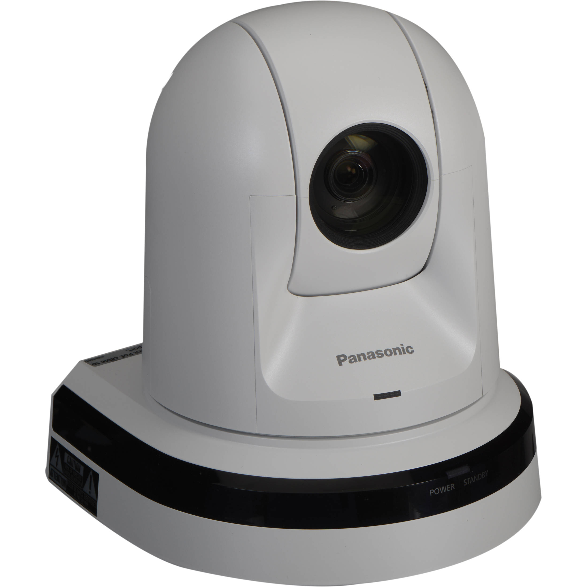
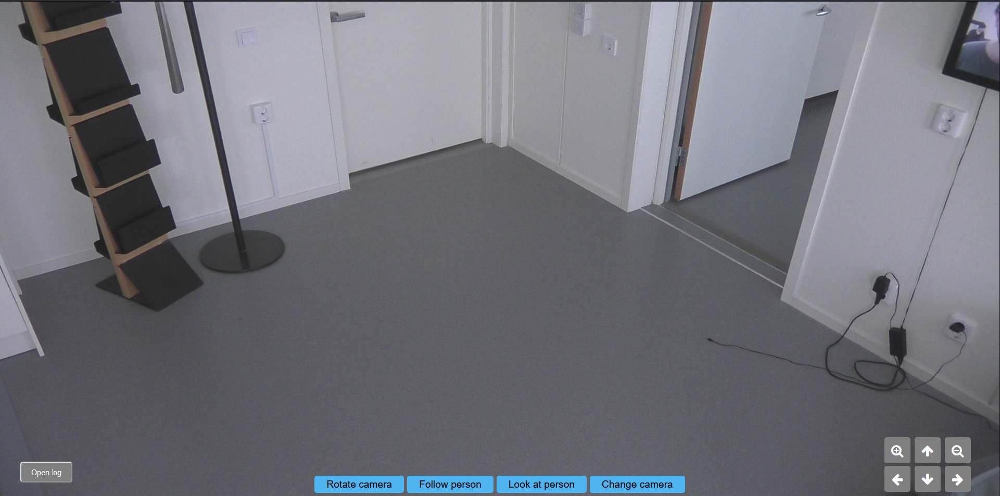

# <div id="top"></div>

<!--
*** Thanks for checking out the Best-README-Template. If you have a suggestion
*** that would make this better, please fork the repo and create a pull request
*** or simply open an issue with the tag "enhancement".
*** Don't forget to give the project a star!
*** Thanks again! Now go create something AMAZING! :D
-->


<!-- PROJECT SHIELDS -->
<!--
*** I'm using markdown "reference style" links for readability.
*** Reference links are enclosed in brackets [ ] instead of parentheses ( ).
*** See the bottom of this document for the declaration of the reference variables
*** for contributors-url, forks-url, etc. This is an optional, concise syntax you may use.
*** https://www.markdownguide.org/basic-syntax/#reference-style-links
-->
[![Contributors][contributors-shield]][contributors-url]
[![Forks][forks-shield]][forks-url]
[![Stargazers][stars-shield]][stars-url]
[![Issues][issues-shield]][issues-url]
[![MIT License][license-shield]][license-url]
[![LinkedIn][linkedin-shield]][linkedin-url]


<!-- PROJECT LOGO -->
<br />
<div align="center">
  <a href="https://github.com/ItzCornflakez/D0020E_Project">
    
  </a>

<h3 align="center">Camera control using computer vision with OpenCV</h3>

  <p align="center">
     A project focused on camera control
    <br />
    <a href="https://github.com/ItzCornflakez/D0020E_Project"><strong>Explore the docs »</strong></a>
    <br />
    <br />
    <a href="https://github.com/ItzCornflakez/D0020E_Project">View Demo</a>
    ·
    <a href="https://github.com/ItzCornflakez/D0020E_Project/issues">Report Bug</a>
    ·
    <a href="https://github.com/ItzCornflakez/D0020E_Project/issues">Request Feature</a>
  </p>
</div>


<!-- TABLE OF CONTENTS -->
<details>
  <summary>Table of Contents</summary>
  <ol>
    <li>
      <a href="#about-the-project">About The Project</a>
      <ul>
        <li><a href="#built-with">Built With</a></li>
      </ul>
    </li>
    <li>
      <a href="#getting-started">Getting Started</a>
      <ul>
        <li><a href="#prerequisites">Prerequisites</a></li>
        <li><a href="#installation">Installation</a></li>
      </ul>
    </li>
    <li><a href="#usage">Usage</a></li>
    <li><a href="#roadmap">Roadmap</a></li>
    <li><a href="#contributing">Contributing</a></li>
    <li><a href="#license">License</a></li>
    <li><a href="#contact">Contact</a></li>
    <li><a href="#acknowledgments">Acknowledgments</a></li>
  </ol>
</details>


<!-- ABOUT THE PROJECT -->

## About The Project



This is a project aimed at assisting healthcare workers looking to observe their patients. The project achieves this by
using a Aw-he40 HD integrated camera for visuals and an AI with computer vision to obtain the position in the room. That
position is then converted with some linear algebra to a rotation that the camera can understand.

This project is heavily based on the project "Camera control using UWB-navigation with WideFind sensors".

<p align="right">(<a href="#top">back to top</a>)</p>

### Built With

* [Python](https://www.python.org/)
* [Javascript](https://www.javascript.com/)
* [Mqtt](https://mqtt.org/)

<p align="right">(<a href="#top">back to top</a>)</p>


<!-- GETTING STARTED -->

## Getting Started

Perform the following to install and run the program in your code editor of choice.

### Prerequisites

The following software is required in order to run this application:

* Xampp Control Panel
  Download and run, turn on apachee and mysql. Open up [http://localhost/phpmyadmin](http://localhost/phpmyadmin) create
  a database named 'log' and a table 'log_table' then import database_setup.myqsl.
* A code editor, recommending visual studio code.
* Firefox or Safari browser

### Required python libraries

* pymysql
* paho-mqtt
* requests
* flask

These can be installed using the ... file.

### Installation

1. Begin by doing the prerequisites
2. Download the zip file of the project and unpack it in your code editor of choice.
3. Start the Xampp control panel and boot up apachee and mysql.
4. Make sure to create a database in mysql with the name 'log' and table 'log_table'.
5. Run the app.py file in your editor.
6. Open up firefox browser and put in http://127.0.0.1:5000/.

<p align="right">(<a href="#top">back to top</a>)</p>


<!-- Git -->
## Git

Make sure you are standing inside a folder (in the console) where you would like the project to exist. 
After you can run the command: 

```
git clone https://github.com/RyuTribal/DarkFantasies.git

```
To create a branch:
```
git branch your-branch-name
```
To switch branches:
```
git checkout your-branch-name
```
To save changes made to a file:
```
git add .
```

To finalize your changes (no going back):
```
git commit -m "A useful message for the other developers about what changes you made"
``` 

To push code to a branch:
```
git push origin your-branch-name
```

To pull new changes from a branch:
```
git pull origin your-branch-name
```

<p align="right">(<a href="#top">back to top</a>)</p>


<!-- USAGE EXAMPLES -->

## Usage

--

<p align="right">(<a href="#top">back to top</a>)</p>


<!-- ROADMAP -->

## Roadmap

See the [open issues](https://github.com/ItzCornflakez/D0020E_Project/issues) for a full list of proposed features (and
known issues).

<p align="right">(<a href="#top">back to top</a>)</p>


<!-- CONTRIBUTING -->

## Contributing

Contributions are what make the open source community such an amazing place to learn, inspire, and create. Any
contributions you make are **greatly appreciated**.

If you have a suggestion that would make this better, please fork the repo and create a pull request. You can also
simply open an issue with the tag "enhancement".
Don't forget to give the project a star! Thanks again!

1. Fork the Project
2. Create your Feature Branch (`git checkout -b feature/AmazingFeature`)
3. Commit your Changes (`git commit -m 'Add some AmazingFeature'`)
4. Push to the Branch (`git push origin feature/AmazingFeature`)
5. Open a Pull Request

<p align="right">(<a href="#top">back to top</a>)</p>


<!-- LICENSE -->

## License

Distributed under the MIT License. See `LICENSE.txt` for more information.

<p align="right">(<a href="#top">back to top</a>)</p>


<!-- CONTACT -->

## Contact

Mohammed Dinawi - mohdin-0@student.ltu.se

Jenny Enckell - jenenc-0@student.ltu.se

Mohammed Shakir - mohsha-0@student.ltu.se

Ahmad Allahham - ahmall-0@student.ltu.se


<p align="right">(<a href="#top">back to top</a>)</p>

## Demo
Video(https://drive.google.com/file/d/1LvV4icfneGYp8JLNQKXUjfC-xWd9qBBX/view?usp=sharing)


<!-- ACKNOWLEDGMENTS -->

## Acknowledgments

This project is based on the code and documentation created by

Alexander Österberg - [@Alexandersterb1](https://twitter.com/Alexandersterb1) - dikesalex@gmail.com

Martin Askolin - marsak-8@student.ltu.se

Isak Lundmark - lunisa-9@student.ltu.se

Filip Bergström - filber-9@student.ltu.se

Marcus Eriksson - amueri-6@student.ltu.se

Project Link: [https://github.com/ItzCornflakez/D0020E_Project](https://github.com/ItzCornflakez/D0020E_Project)

<p align="right">(<a href="#top">back to top</a>)</p>


<!-- MARKDOWN LINKS & IMAGES -->
<!-- https://www.markdownguide.org/basic-syntax/#reference-style-links -->

[contributors-shield]: https://img.shields.io/github/contributors/ItzCornflakez/D0020E_Project.svg?style=for-the-badge

[contributors-url]: https://github.com/ItzCornflakez/D0020E_Project/graphs/contributors

[forks-shield]: https://img.shields.io/github/forks/ItzCornflakez/D0020E_Project.svg?style=for-the-badge

[forks-url]: https://github.com/ItzCornflakez/D0020E_Project/network/members

[stars-shield]: https://img.shields.io/github/stars/ItzCornflakez/D0020E_Project.svg?style=for-the-badge

[stars-url]: https://github.com/ItzCornflakez/D0020E_Project/stargazers

[issues-shield]: https://img.shields.io/github/issues/ItzCornflakez/D0020E_Project.svg?style=for-the-badge

[issues-url]: https://github.com/ItzCornflakez/D0020E_Project/issues

[license-shield]: https://img.shields.io/github/license/ItzCornflakez/D0020E_Project.svg?style=for-the-badge

[license-url]: https://github.com/ItzCornflakez/D0020E_Project/blob/master/LICENSE.txt

[linkedin-shield]: https://img.shields.io/badge/-LinkedIn-black.svg?style=for-the-badge&logo=linkedin&colorB=555

[linkedin-url]: https://linkedin.com/in/linkedin_username

[product-screenshot]: images/screenshot.png
